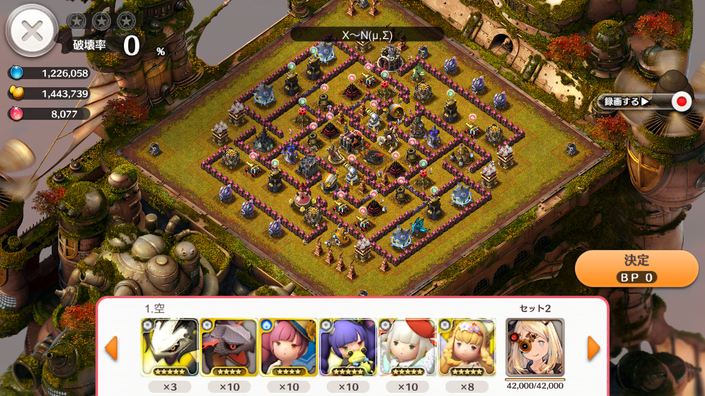
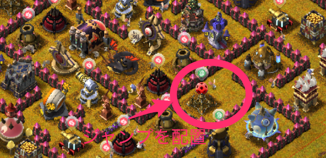

## 27番

--
### 補足

- ノアは回復
- 援軍は全部チュロス

---
### [27番] 陸

- [Rさんの陸攻め](https://play.lobi.co/video/2af8f654f2c802e4e695a2ba9d8fd67d22231938)
- [シーザーPT](https://play.lobi.co/video/8d893dd744bb0e42f3c7b0e7d09a10d2a5ab2b26)

--
#### 攻め方

- 目玉を横から破壊するため、画像位置にジャンプを配置
- 誘導に流れないよう、事前に周囲の施設を破壊

--
#### 攻め方(Xの場合)

- 誘導配置の場合、壁に穴が開けにくいことが多い
- 私の場合、援軍をうまく利用して壁に穴を開けることが多い(動画参照)
