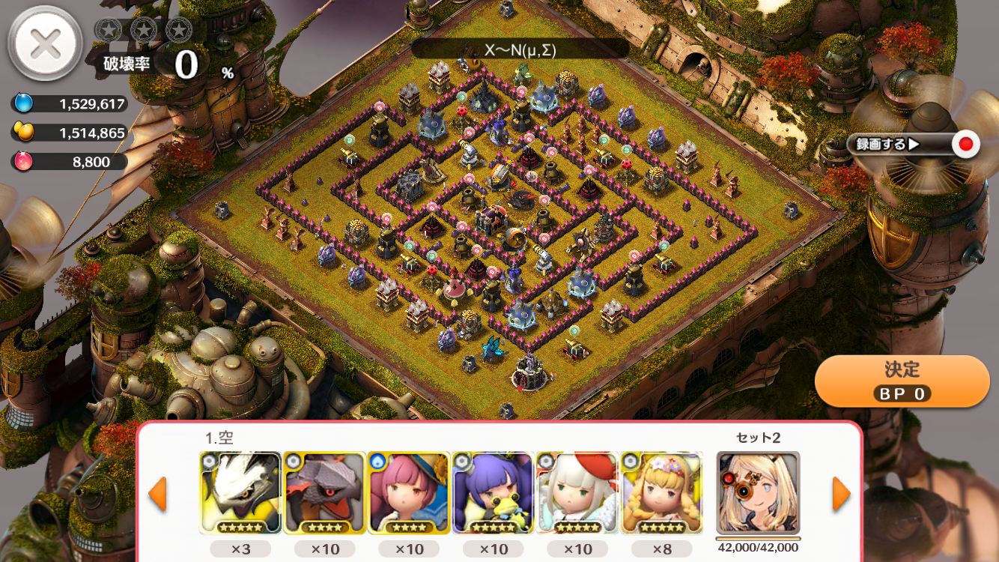
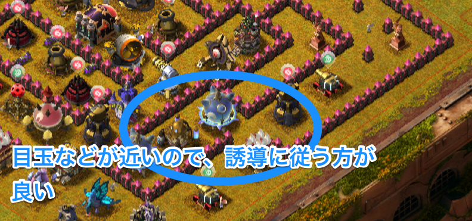

## 28番

--
### 補足

- ノアは回復
- 援軍は全部チュロス

---
### [28番] 陸

[シーザー入りPT](https://play.lobi.co/video/8cd27ca1bbdd7057e538f10cc32e41f3221e61de)

--
#### 攻め方

- 目玉の裏側をジャンプで越えるような攻め方の場合、非常に辛い配置となっている
- 一方、目玉と扇風機が近いので、正攻法で攻めると抜きやすい
- 目玉と扇風機を破壊する前に閃光にハマると辛いので、ハツメを初手に出して罠を解除する

--
#### スキル

- メガトン2個焼きして、目玉と扇風機を早めに破壊できるようにスキルを使うと良い
- 動画ではジャンプを使っているが、ストサでも良いような気がする
