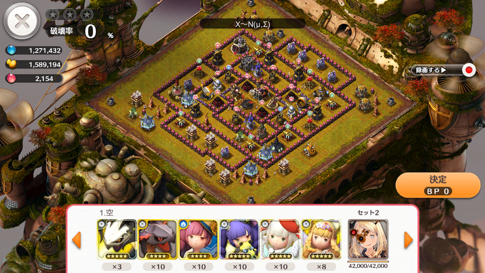
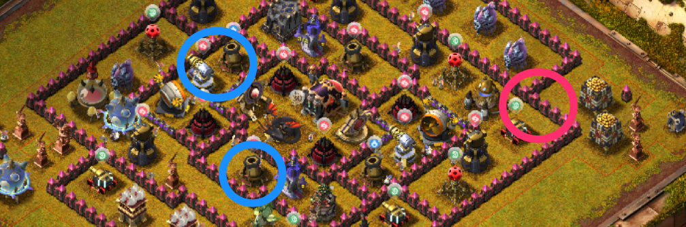

## 29番

--

- ノアは回復
- 援軍は召喚施設がマーリン、その他がチュロス

---
### [29番] 陸

[シーザーPT]( https://play.lobi.co/video/09f7d8b7768f699f32828c10f4d48d78853c0078)

--
#### 攻め方

- 赤丸の壁を破って、青丸の施設を破壊(速射とメガトンはどちらか壊せばOK)すれば、破った壁側のメガトンと速射もすぐ破壊できる
- 魔法壁は避けたいので、ジャンプを使う場合はコアの右上辺りに置くと良い
---
### [29番] 空

割愛します(というか攻略できない)
