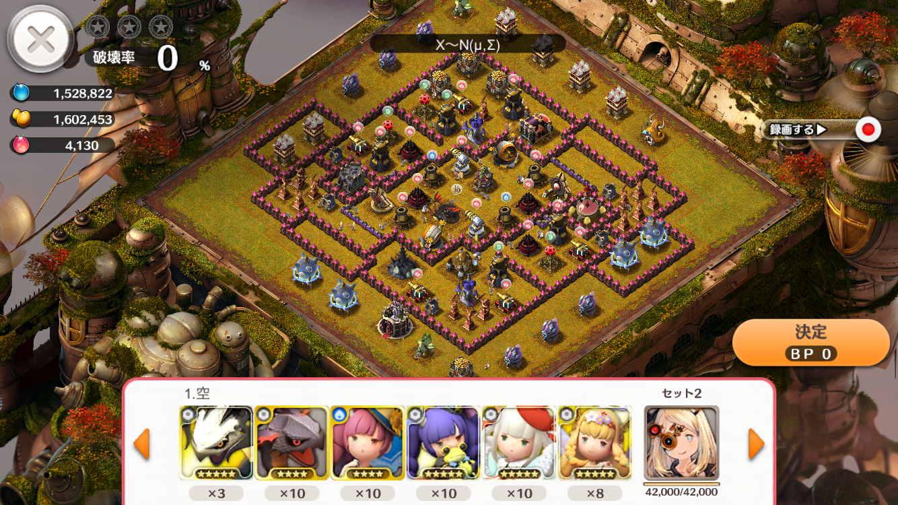
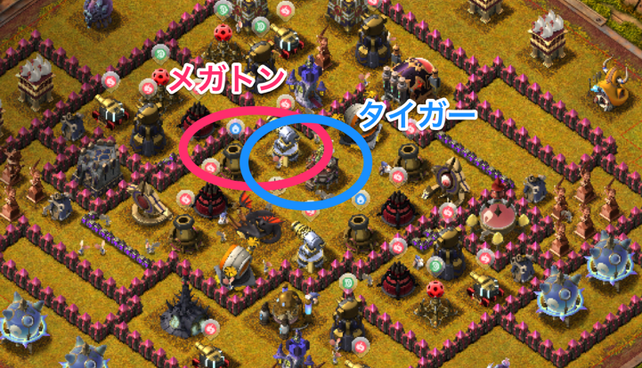
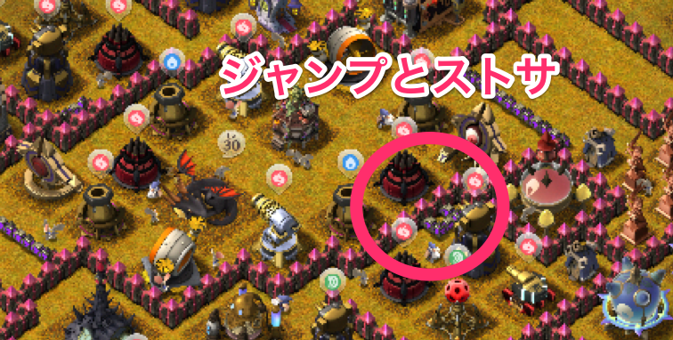
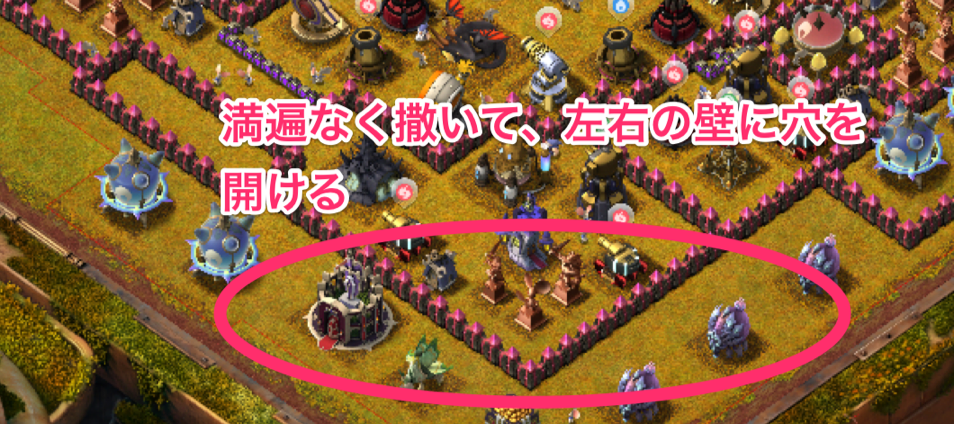

## 30番

--
### 補足

- ノアは回復
- 援軍はフレンドのみプルートで、他はチュロス

---
### [30番] 陸

- [Rさんの陸攻め](https://play.lobi.co/video/976256d84695ff1e22b880989cf0a7eb895177e0)

--
#### 焼きポイント

- メガトンクラッシュを速射とメガトンに当てる
- タイガーフロストを速射とフレンド施設に当てる

--
#### その他のスキル

- ストサとジャンプを画像の箇所に配置
- 目玉等を破壊
- 魔法壁がストサで無効化できることがポイント

--
#### その他

- 左右の壁にうまく穴が開くと、ターゲットが分散され、かつ手前の主要防衛施設が破壊できる

---
### [30番] 空

[Rさんの空攻め](https://play.lobi.co/video/d5b859edf5e64780fb22cf951958d576a9a05326)

こちらは私では再現できず、攻略らしいことが書けませんので省略します・・・。
